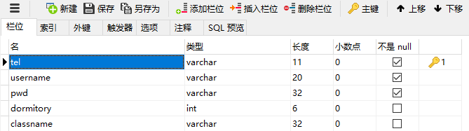
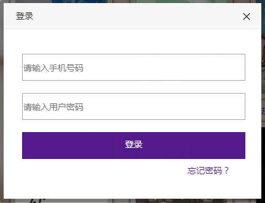

# 校园旧书网

### 主要技术
HTML + CSS + JavaScript + JQuery + Bootstrap + PHP + MySQL

### 项目描述
在大学校园里，每到毕业季，旧书的处理方式就成为一个棘手的问题。在微信群和朋友圈各种社交平台，经常能看到即将离校的学子发图片询问朋友是否有需要，转赠他人，或丢弃，很少人会拉下面子去摆摊卖旧书；而到了新生季，大部分学生不愿意花高价钱去购买新书，会选择向认识的师兄师姐借书，或者买旧书。因此，有必要为这类人群开发一个用于校园旧书交易的网站，提供买卖信息，达到双赢效果。

##### 1．需求分析
###### 1.1 功能
<pre>（1）用户注册与登录。
（2）发布卖书信息。
（3）最新发布模块。
（4）书籍信息显示。
（5）发布的所有书籍分页显示。
（6）书籍关键字查询。
（7）书籍及相关信息收藏功能。
（8）订单功能。
</pre>

权限要求：只有注册登录后的用户才可以发布卖书信息，查看收藏和订单
注册登录模块：可添加验证码阻止恶意登录与注册，第三方登录。
忘记密码；搜索功能。

###### 1.2 数据字典
书籍信息表（tb_book_info） 
 
用户信息表（tb_user） 
 
订单表（tb_order） 
 
收藏表（tb_collect） 
 
 
##### 2．概念设计
E-R 图 
书籍实体及属性 
   
用户实体及属性 
  					
两个实体之间的联系 
  
   
##### 3. 逻辑设计
  

##### 4. 系统设计与实现
本网站采用Navicat for MySQL软件编写数据库。
tb_book_info表：
    
tb_user表： 
    
tb_order表： 
   
tb_collect表： 
    

### 操作说明

  （事先我是在MySQL官网、PHP官网和Apache官网分别下载好，并下载Navicat for MySQL，打上破解补丁，开启MySQL服务,Navicat for MySQL连接数据库）

（1）打开网站首页（后来有修改轮播图和导航，后续更新文档）
  

（2）注册和登陆功能
点击网站右上角的“注册”，输入相关信息，点击“注册”完成注册：
  

再点击网站右上角的“登录”，输入相关信息，完成登录：
 
（3） 卖书功能
登录成功后，网站右上角出现用户手机号码，并出现“我要卖书”字样：
  

点击可进入“发布卖书信息”页面：
  
输入ISBN码，点击“联网查询图书信息”按钮，即自动有“书籍名称”，“作者”，“出版社”，“原价参考”，用户只要输入“出售单价”，“出售数量”，即可“发布图书”；在联网查询不出图书信息时，可手动输入相关信息，封面链接则由上传图片的方式自动获取图片链接，“选择文件”后“确定上传图片”，即可“发布图片”。
 
提示“发布成功”后，点击图片或“返回主页”字样均可回到主页：
  

（4） 买书功能
点击首页的图片和书名均可进入书籍详情页：
  
书籍详情页：
  
点击“购买”。

所有书籍
	点击首页的“更多”可查看所有书籍，点击“下一页”，或选择页码，或“上一页”：
  

（5）收藏功能
在详情页看到心仪的书可点击“收藏”，收藏后可由首页的“我的收藏”进入查看收藏的相关信息。

（6） 购买功能
	在详情页看到心仪的书可点击“购买”，购买后书籍相关信息会收入订单。

（7） 查看订单功能
	由首页的“我的订单”进入。

#### License
GPL
